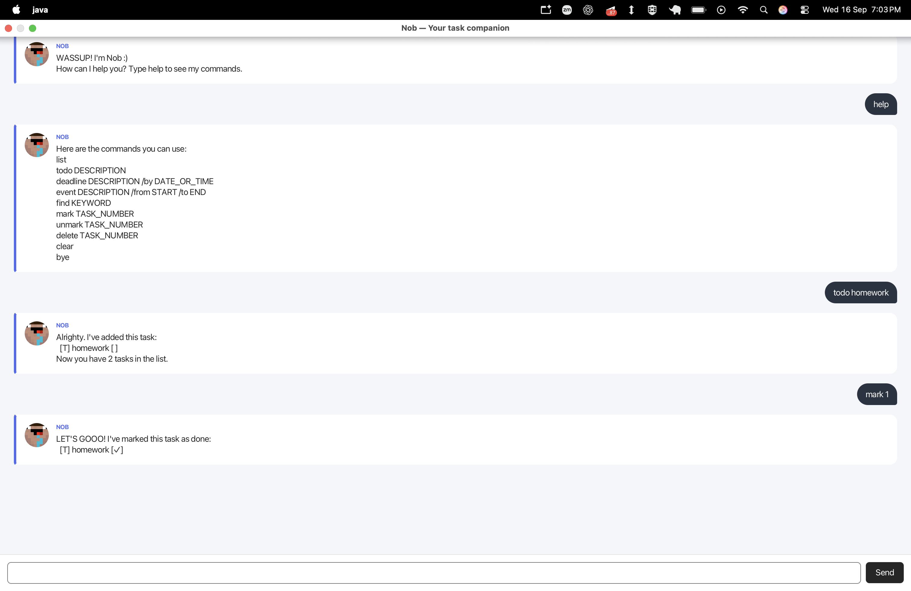

# Nob User Guide

Nob is a friendly desktop task manager that helps you keep track of to-dos,
deadlines, and events using short text commands.



## Quick start

1. Ensure that Java 25 or later is installed.
2. Open a terminal in the folder containing `nob.jar`.
3. Start Nob:

   ```sh
   java -jar nob.jar
   ```

   If you are running Nob from its source repository instead, use:

   ```sh
   ./gradlew run
   ```

   On Windows, use `gradlew.bat run` instead.

4. Type a command into the box at the bottom of the window and press **Enter**
   or click **Send**.

Try `help` first to see the commands available in the app.

> **Tip:** Command words such as `todo` and `mark` must be typed exactly as
> shown. Replace words in `UPPER_CASE` with your own information.

## Command summary

| Action | Command | Example |
| --- | --- | --- |
| Show help | `help` | `help` |
| Add a to-do | `todo DESCRIPTION` | `todo read chapter 3` |
| Add a deadline | `deadline DESCRIPTION /by DATE_OR_TIME` | `deadline submit report /by 20/9/2026 1800` |
| Add an event | `event DESCRIPTION /from START /to END` | `event project meeting /from 20/9/2026 1400 /to 20/9/2026 1600` |
| Show every task | `list` | `list` |
| Find tasks | `find KEYWORD` | `find report` |
| Mark a task done | `mark TASK_NUMBER` | `mark 2` |
| Mark a task not done | `unmark TASK_NUMBER` | `unmark 2` |
| Delete a task | `delete TASK_NUMBER` | `delete 2` |
| Delete all tasks | `clear` | `clear` |
| Exit Nob | `bye` | `bye` |

## Features

### Viewing help: `help`

Shows the complete command list inside Nob.

```text
help
```

### Adding a to-do: `todo`

Adds a task without a date or time.

Format: `todo DESCRIPTION`

```text
todo borrow a library book
```

Nob adds the task and reports its new position in the list.

### Adding a deadline: `deadline`

Adds a task that must be completed by a particular date or time.

Format: `deadline DESCRIPTION /by DATE_OR_TIME`

```text
deadline submit report /by 20/9/2026 1800
```

Keep one space before and after `/by`. Nob understands common formats such as
`20/9/2026 1800`, `2026-09-20 18:00`, and `Sep 20 2026, 6:00PM`. If a value
cannot be interpreted as a date, Nob keeps and displays the text as entered.

### Adding an event: `event`

Adds a task that takes place between a start and end time.

Format: `event DESCRIPTION /from START /to END`

```text
event project meeting /from 20/9/2026 1400 /to 20/9/2026 1600
```

Keep one space before and after `/from` and `/to`. When Nob recognizes both
times, the end cannot be earlier than the start. Time-only inputs such as
`2pm`, `14:00`, and `1400` are also supported for this check.

### Listing tasks: `list`

Shows all tasks with their task numbers and completion states.

```text
list
```

Use the displayed task number with `mark`, `unmark`, and `delete`.

### Finding tasks: `find`

Shows tasks whose descriptions contain the keyword. Matching is not
case-sensitive.

Format: `find KEYWORD`

```text
find report
```

For example, `find report` matches both `draft report` and `REPORT review`.

### Marking a task as done: `mark`

Marks the numbered task as completed.

Format: `mark TASK_NUMBER`

```text
mark 2
```

Task numbers start at `1` and are shown by the `list` command.

### Marking a task as not done: `unmark`

Returns a completed task to the incomplete state.

Format: `unmark TASK_NUMBER`

```text
unmark 2
```

### Deleting one task: `delete`

Permanently removes the numbered task.

Format: `delete TASK_NUMBER`

```text
delete 2
```

After deletion, the remaining task numbers may change. Run `list` again before
using another task number.

### Clearing all tasks: `clear`

Permanently removes every task from the list.

```text
clear
```

> **Warning:** `clear` removes the entire list at once and cannot be undone.

### Exiting Nob: `bye`

Displays Nob's farewell message and closes the application.

```text
bye
```

## Saving data

Nob saves the task list automatically after every add, mark, unmark, delete,
or clear operation. Saved tasks are restored the next time Nob starts; no
manual save command is needed.

Do not edit or delete the `data/nob.txt` file while Nob is running.

## Troubleshooting

- **Nob says the command is unknown:** Run `help` and check the command word.
- **Nob reports a missing description:** Add text after `todo`, `deadline`, or
  `event`.
- **Nob rejects a date command:** Check the spaces around `/by`, `/from`, and
  `/to`.
- **Nob rejects a task number:** Run `list` and use a number currently shown.
- **Nob does not start:** Confirm that `java -version` reports Java 25 or later.
